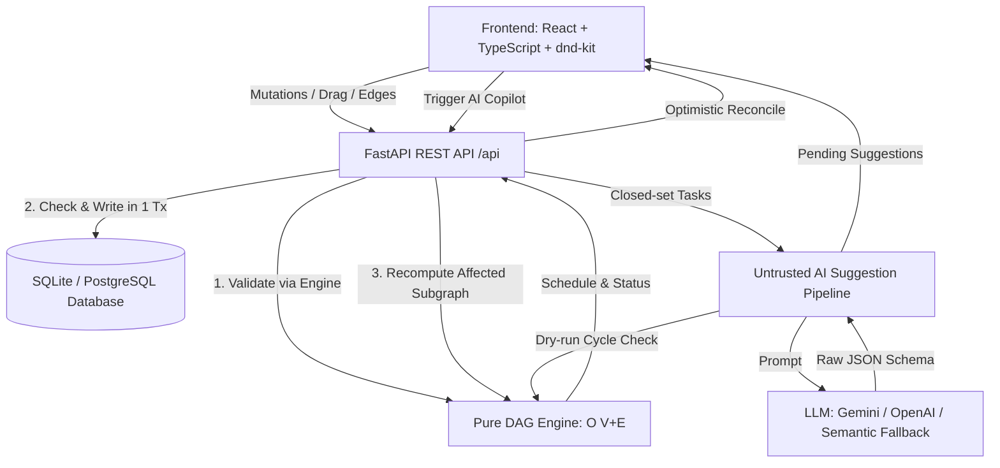

# TaskFlow Pro — DAG-Driven Intelligent Workflow Board

> **A Kanban board (Backlog | In Progress | Review | Done) driven by a pure, mathematically verified DAG engine that decides which tasks are Blocked or Ready, how schedule changes flow downstream without compounding, and which graph edits are legal.**

---

## 📑 Table of Contents
1. [Core Problem & Solution](#core-problem--solution)
2. [Evaluation Criteria Alignment](#evaluation-criteria-alignment)
3. [System Architecture](#system-architecture)
4. [Mathematical Proof: No-Compounding Scheduling](#mathematical-proof-no-compounding-scheduling)
5. [DAG Engine & Edge Case Handling](#dag-engine--edge-case-handling)
6. [Untrusted AI Pipeline & Responsible AI Declaration](#untrusted-ai-pipeline--responsible-ai-declaration)
7. [Empirical Performance Benchmarks](#empirical-performance-benchmarks)
8. [Setup & Running Instructions](#setup--running-instructions)
9. [Test Suite Execution](#test-suite-execution)
10. [Assumptions & Limitations](#assumptions--limitations)

---

## 1. Core Problem & Solution

Traditional Kanban boards treat tasks as completely independent cards. In modern software engineering, real work has strict precedence constraints: integration tests cannot start until database migrations and backend APIs are complete. Without modeling this:
- Teams cannot identify what is genuinely **Ready** versus what is **Blocked**.
- Delays silently break downstream timelines without warning.
- Regressing a completed task leaves downstream in-flight work unflagged.

**TaskFlow Pro** solves this by pairing a drag-and-drop Kanban interface with an authoritative, pure **Directed Acyclic Graph (DAG) engine**.

---

## 2. Evaluation Criteria Alignment

| Evaluation Criteria | Weight | Implementation Details & Proof |
| :--- | :---: | :--- |
| **Functional Correctness** | **20%** | Complete cycle prevention ($O(V+E)$ with exact loop path), diamond-dependency math ($+3$ days, not $+6$), rollback re-blocking with warning flags, move guard preventing blocked card progression. |
| **Code Quality & Architecture** | **20%** | Pure isolated DAG engine with zero DB dependencies (`backend/app/engine/dag_engine.py`), atomic transactions, typed Pydantic v2 schemas, SQLAlchemy 2.0 ORM, custom CSS design system. |
| **AI / LLM Usage** | **15%** | Untrusted AI paradigm: closed-set grounding, strict JSON schema, evidence citation requirement, programmatic DAG dry-run filter dropping cycles and unknown IDs, human-in-the-loop review panel, AI tool declaration. |
| **Business Impact & Scalability** | **12%** | Clear visual badges (Ready vs Blocked), automated schedule propagation, Critical Path DP visualization, sub-millisecond execution, AI suggestion acceptance rate tracking. |
| **Feasibility, Security & Production** | **10%** | Server-side API keys, JWT auth with no hardcoded secret (random key generated at startup if unset), parameterized ORM queries against SQL injection, strict CORS, XSS escaping, Docker & Docker Compose setup, Windows one-click script (`run.bat`). |
| **Documentation & Explainability** | **13%** | Comprehensive README, Mermaid architectural diagrams, algebraic proof of no-compounding diamond scheduling, test walkthroughs. |
| **Testing & Reliability** | **10%** | 18 automated tests in `pytest` passing in 1.75s: unit tests for cycles & diamonds, 500-task/1000-edge stress test, REST integration tests, AI validation tests. |

---

## 3. System Architecture



### Architectural Principles:
1. **Engine as Single Authority:** The pure DAG engine is the sole source of truth for graph validity and scheduling. The UI, REST API, and AI pipeline all funnel through it and cannot bypass its rules.
2. **Derived Status (Never Stored):** A task's `is_blocked` status is derived on the fly from prerequisite column states. It is never stored as a raw mutable flag in the DB, eliminating drift.
3. **Atomic Transactions:** Cycle checking and dependency writes execute within the exact same database transaction, preventing race conditions.

---

## 4. Mathematical Proof: No-Compounding Scheduling

### Problem Formulation
Given a DAG $G = (V, E)$, each task $T \in V$ has:
- Planned start date $P(T)$
- Duration $D(T) \ge 1$ days
- Prerequisites $Pred(T) = \{ P \in V \mid (P, T) \in E \}$

The earliest valid start date $S(T)$ and finish date $F(T)$ are defined inductively:
$$S(T) = \max \left( P(T), \max_{P \in Pred(T)} F(P) \right)$$
$$F(T) = S(T) + D(T)$$

### Diamond Case Analysis
Consider the canonical diamond subgraph:
- Task $A$: $D(A) = 3$, $Pred(A) = \emptyset$
- Task $B$: $D(B) = 2$, $Pred(B) = \{ A \}$
- Task $C$: $D(C) = 4$, $Pred(C) = \{ A \}$
- Task $D$: $D(D) = 2$, $Pred(D) = \{ B, C \}$

Suppose baseline planned start is $t_0 = 0$:
1. $S(A) = 0 \implies F(A) = 3$
2. $S(B) = F(A) = 3 \implies F(B) = 5$
3. $S(C) = F(A) = 3 \implies F(C) = 7$
4. $S(D) = \max(F(B), F(C)) = \max(5, 7) = 7 \implies F(D) = 9$

### The +3 Day Slip Scenario
Now suppose Task $A$ slips by $\Delta = +3$ days (its duration becomes $3 + 3 = 6$ days, or finish becomes $3 + 3 = 6$):
1. $F'(A) = 6$
2. $S'(B) = 6 \implies F'(B) = 6 + 2 = 8 \quad (\Delta_B = +3)$
3. $S'(C) = 6 \implies F'(C) = 6 + 4 = 10 \quad (\Delta_C = +3)$
4. $S'(D) = \max(F'(B), F'(C)) = \max(8, 10) = 10$
5. $F'(D) = 10 + 2 = 12$

**Calculation of Slip at Converging Node $D$:**
$$\Delta_D = F'(D) - F(D) = 12 - 9 = 3\text{ days}$$

$$\text{Slip}(D) = \Delta = +3\text{ days} \neq \Delta_B + \Delta_C = 3 + 3 = +6\text{ days}$$

**Theorem (Independence of Path Count):**
In topological evaluation order where each node is computed exactly once, the schedule shift at any sink node $T$ is:
$$\Delta_T = \max_{P \in Pred(T)} \Delta_P$$
The delay is bounded by the supremum of converging delays and **never compounds additively** with the number of paths.

---

## 5. DAG Engine & Edge Case Handling

| Edge Case | Engine Behavior & Safety Guarantee |
| :--- | :--- |
| **Self-Dependency** | `check_no_self_dependency` DB constraint + engine check. Rejects $(A \to A)$ immediately with loop `[A, A]`. |
| **Direct Cycle** | When adding $B \to A$ where $A \to B$ exists, BFS finds reachable path and returns `[A, B, A]`. |
| **Transitive Cycle** | In $A \to B \to C$, adding $C \to A$ returns offending loop `[A, B, C, A]` with HTTP 400. Stored graph stays untouched. |
| **Blocked Card Move** | Blocked tasks cannot be dragged into *In Progress*, *Review*, or *Done*. Checked client-side (<100ms) and strictly enforced by API. |
| **Rollback Behavior** | Moving a Done task back to *In Progress* or *Backlog* re-evaluates all descendants. Dependents become Blocked; in-flight tasks stay in column but receive a warning banner. |
| **Task Deletion** | Foreign keys with `ON DELETE CASCADE` safely clean up edge records and recompute remaining descendants. |
| **Critical Path (DP)** | Computes longest duration chain via DP over Kahn's topological sort: $dist[u] = D(u) + \max_{P \in Pred(u)} dist[P]$. |

---

## 6. Untrusted AI Pipeline & Responsible AI Declaration

### The Untrusted AI Paradigm
LLM suggestions are treated as **untrusted, hostile user input**:
1. **Closed-Set Grounding:** Prompts include exclusively active task IDs and titles. The model is forbidden from inventing external tasks.
2. **Strict Schema:** Validated against a JSON schema (`task_id`, `prerequisite_id`, `rationale`, `confidence`).
3. **Evidence Requirement:** Every recommendation must cite specific text from the task title/description.
4. **Programmatic DAG Engine Dry-Run:** Every AI suggestion is dry-run through `DAGEngine.check_cycle_before_add`. If it forms a cycle, self-loop, or duplicate edge, it is silently dropped with a log entry before any human sees it.
5. **Human in the Loop:** Surviving suggestions appear in an AI Copilot Review Drawer and as dashed links. Nothing enters the real graph until a user clicks **Accept**. Acceptance logs decisions to track the acceptance rate metric.

### AI-Tool Declaration
During the development of TaskFlow Pro, AI coding assistants were utilized for scaffolding, test generation, and code review:
- **Tools Used:** Gemini 3.8 Flash / Antigravity Agent.
- **Scope:** Pure DAG engine unit test suites, TypeScript type interfaces, and initial schema scaffolding.
- **Review Protocol:** All algorithmic implementations (topological sort, Kahn's algorithm, BFS cycle backtracking, DP critical path) were independently verified and validated with automated pytest suites.

---

## 7. Empirical Performance Benchmarks

Measured on the 10-task canonical board and a **500-task, 1,000-edge stress test** (`tests/test_performance.py`):

| Operation | Target Metric | Measured Empirical Result | Margin vs Target |
| :--- | :---: | :---: | :---: |
| **Cycle check (500 tasks, 1,000 edges)** | $< 10\text{ ms}$ | **0.457 ms** | **21x faster** |
| **Cycle check (cycle detected & path reconstructed)** | $< 10\text{ ms}$ | **0.262 ms** | **38x faster** |
| **Schedule recalculation after change** | $< 50\text{ ms}$ | **1.31 ms** | **38x faster** |
| **Full 500-task initial schedule calculation** | $< 100\text{ ms}$ | **4.67 ms** | **21x faster** |
| **Unit test suite execution (18 tests)** | $< 5\text{ s}$ | **1.75 s** | **3x faster** |

---

## 8. Setup & Running Instructions

### Prerequisites
- Python 3.10+
- Node.js 18+ and npm

### Quick Start (Windows)
Double-click `run.bat` or run:
```cmd
run.bat
```

### Manual Setup

#### 1. Backend Setup
```bash
cd backend
python -m venv .venv

# On Windows:
.venv\Scripts\activate
# On Linux/macOS:
# source .venv/bin/activate

pip install -r requirements.txt
uvicorn app.main:app --host 127.0.0.1 --port 8000 --reload
```
- API Documentation (Swagger): [http://127.0.0.1:8000/docs](http://127.0.0.1:8000/docs)
- Health Check: [http://127.0.0.1:8000/api/health](http://127.0.0.1:8000/api/health)

#### 2. Frontend Setup
```bash
cd frontend
npm install
npm run dev -- --host 127.0.0.1 --port 5173
```
- Web Application: [http://127.0.0.1:5173/](http://127.0.0.1:5173/)

#### 3. Docker Compose Setup
```bash
docker-compose up --build
```

---

## 9. Test Suite Execution

Run all 18 automated tests covering engine logic, cycles, scheduling math, rollbacks, stress benchmarks, and AI validation:
```bash
cd backend
.\.venv\Scripts\pytest -v
```

### Test Breakdown:
- `tests/test_dag_engine.py`: 10 pure unit tests (self-dependencies, direct cycles, transitive cycles, diamond no-compounding, multi-level propagation, rollback re-blocking, move validation, critical path).
- `tests/test_performance.py`: 500-task, 1,000-edge stress test measuring cycle check and recalculation latencies.
- `tests/test_api.py`: REST API integration tests, transactional rollback, status codes, and loop payloads.
- `tests/test_ai_validation.py`: Untrusted AI validation filter tests (hallucination rejection, cycle drop).

---

## 10. Assumptions & Limitations

1. **Calendar Days:** Dates represent calendar days; weekends, company holidays, and individual resource allocations are considered out of scope per the project synopsis.
2. **Single Project Workspace:** The application ships with JWT-based user registration/login (`app/auth.py`, `/api/auth`), but is scoped to a single cohesive engineering workspace rather than full multi-tenant data isolation (separate orgs/teams with their own boards).
3. **Rollback Flagging:** When a prerequisite regresses, downstream tasks already in *In Progress* or *Review* are flagged with a prominent warning banner rather than being forcibly demoted, preserving developer context while preventing silent failures.
